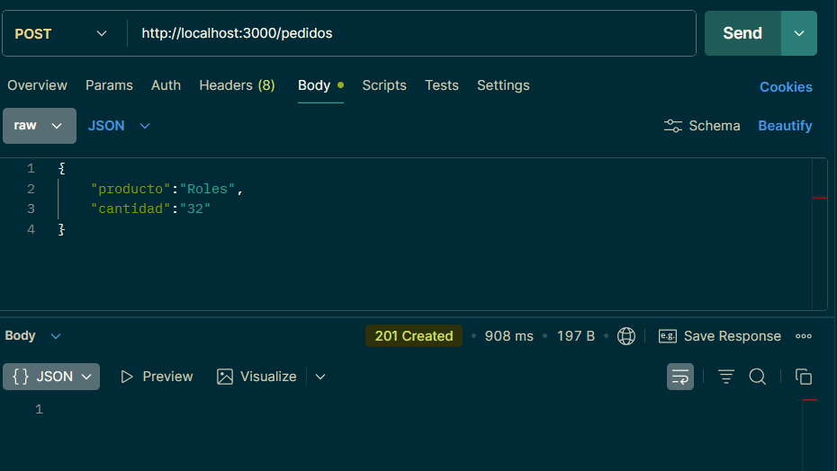
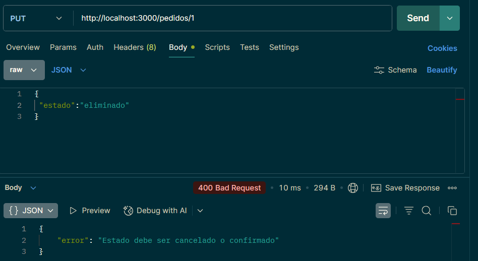

# fullStack__Actividad3
-----------------------------------------------------------------------------------------------------
Actividad 3 de la clase Full Stack
🎯 Objetivo de la actividad
Diseñar e implementar un backend con Express y POO que no solo haga CRUD, sino que aplique reglas de negocio reales, separando correctamente responsabilidades entre:

* routes
* controllers
* repositories
-----------------------------------------------------------------------------------------------------
# Desarrollo
En esta actividad se trabaja el proceso de solicitudes de pedidos, los cuales tienen como atributos: ID, nombre del producto, cantidad del producto y el estado.
El proyecto tiene reglas claras:

- Los productos deben tener un stock mayor a 0 (>0).
- Los pedidos pueden tener tres estados: Pendiente, confirmado y cancelado.
- Todos los pedidos registrados deben ser inicializados con un estado "Pendiente" hasta que se modifique o elimine.
- Los pedidos con un estado finalizado (cancelado o confirmado) no pueden volver a cambiar de estado.
- Los pedidos con un estado finalizado no pueden ser eliminados
- Los pedidos al momento de modificarse, deben seguir respetando las reglas de negocio.
- Las modificaciones son parciales. Solo se modifican los campos que el usuario envía.

Durante el procedimiento se usó la librería npm. Se usó Express y --save-dev nodemon durante el desarrollo para facilitar pruebas y crear servidores efímeros de uso local.

El documento inicia en index donde se inicializa el servidor con Express, el cual el primer (y único) listener llama a pedidos.routes.js el cual tiene todos los requests, cada uno llama una función que le toca respectivamente creando la conexión a la base de datos. Pasa por controllers donde todas las reglas se encuentran en ./src/controllers/pedidos.controllers.js donde también se incluyen reglas de lógica para evitar errores durante la compilación y con los request bien solicitados, acceden al repositorio de pedidos. Pedidos se encarga solo de entregar y recibir datos, teniendo como la función más llamada en controllers de getId para identificar la existencia de las búsquedas por id o modificación por id.

-----------------------------------------------------------------------------------------------------
Se uso PostMan para hacer los requests a la página.
## 📡 Endpoints

- Crear pedido
POST /pedidos
Body:
{
  "producto": "Roles",
  "cantidad": "32"
}

- Obtener todos
GET /pedidos

- Obtener por id
GET /pedidos/:id

- Actualizar
PUT /pedidos/:id

- Eliminar
DELETE /pedidos/:id
-----------------------------------------------------------------------------------------------------

Imagenes de PostMan:
- creación correcta

- intento de modificación inválida

- intento de modificación valida

- intento de modificación valida 2

- intento de eliminación inválida por id

- intento de eliminación inválida estado finalizado
